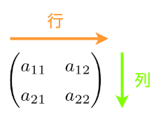
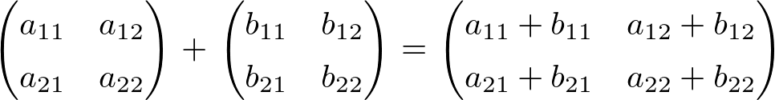
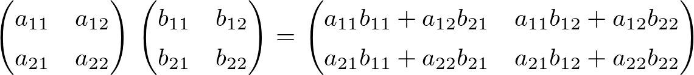
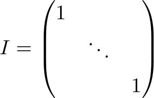
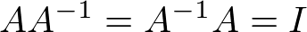
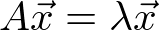

# E資格まとめ {ignore=true} 

## 目次 {ignore=true} 

<!-- @import "[TOC]" {cmd="toc" depthFrom=1 depthTo=5 orderedList=false} -->

<!-- code_chunk_output -->

- [目標](#目標)
- [本題](#本題)
  - [応用数学](#応用数学)
    - [線形代数](#線形代数)
      - [行列](#行列)
      - [計算方法](#計算方法)
      - [単位行列と逆行列](#単位行列と逆行列)
      - [固有値・固有ベクトル](#固有値固有ベクトル)
      - [特異値・特異ベクトル](#特異値特異ベクトル)
    - [統計学](#統計学)
      - [集合](#集合)
      - [確率](#確率)
      - [統計](#統計)
    - [情報科学](#情報科学)
  - [機械学習](#機械学習)
    - [線形回帰モデル](#線形回帰モデル)
    - [非線形回帰モデル](#非線形回帰モデル)
    - [ロジスティック回帰モデル](#ロジスティック回帰モデル)
    - [主成分分析](#主成分分析)
    - [アルゴリズム（k近傍法、k-means）](#アルゴリズムk近傍法-k-means)
    - [サポートベクターマシン（SVM）](#サポートベクターマシンsvm)
  - [深層学習](#深層学習)
    - [入力層〜中間層](#入力層中間層)
    - [活性化関数](#活性化関数)
    - [出力層](#出力層)
    - [勾配降下法](#勾配降下法)
    - [誤差逆伝播法](#誤差逆伝播法)

<!-- /code_chunk_output -->

## 目標
E資格の学習項目のまとめ

## 本題

###　応用数学

#### 線形代数

##### 行列

###### 行列

__行列__ ： 記号や実数・複素数などの要素を、縦方向と横方向に長方形状（正方形も含む）に並べたもの。  

用途は主に次の２つ
* ベクトルの変換
* 連立方程式を解く

横方向を __行__ 
縦方向を __列__ という。

##### 計算方法

加算

乗算

##### 単位行列と逆行列

対角要素がすべて1でそのほかの要素がすべて0である正方行列のことを __単位行列__ という。

行列 A について AX=XA=I となる行列 Y を A の逆行列といい、A-1で表す。

##### 固有値・固有ベクトル

###### 求め方

###### 何に使うの？？

##### 特異値・特異ベクトル

###### 求め方

###### 何に使うの？？

#### 統計学

##### 集合

##### 確率

##### 統計

#### 情報科学

### 機械学習

#### 線形回帰モデル

#### 非線形回帰モデル

#### ロジスティック回帰モデル

#### 主成分分析

#### アルゴリズム（k近傍法、k-means）

#### サポートベクターマシン（SVM）

### 深層学習

#### 入力層〜中間層

#### 活性化関数

#### 出力層

#### 勾配降下法

#### 誤差逆伝播法