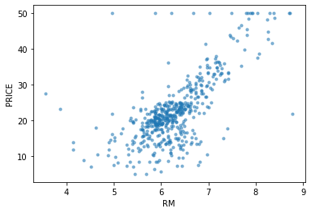
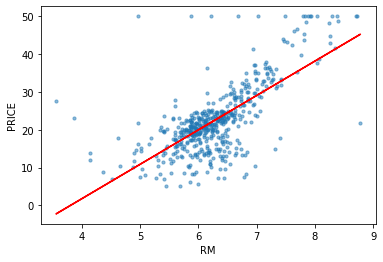
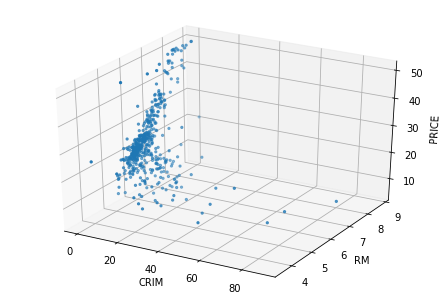

# E 資格まとめ {ignore=true}

## 目次 {ignore=true}

<!-- @import "[TOC]" {cmd="toc" depthFrom=1 depthTo=5 orderedList=false} -->

<!-- code_chunk_output -->

- [目標](#目標)
- [本題](#本題)
  - [応用数学](#応用数学)
    - [線形代数](#線形代数)
      - [行列](#行列)
      - [計算方法（２ × ２の正方行列の場合）](#計算方法2-2の正方行列の場合)
      - [単位行列と逆行列](#単位行列と逆行列)
      - [行列式](#行列式)
      - [固有値・固有ベクトル](#固有値固有ベクトル)
      - [固有値分解](#固有値分解)
      - [特異値・特異ベクトル](#特異値特異ベクトル)
    - [統計学](#統計学)
      - [集合](#集合)
      - [確率](#確率)
      - [余事象](#余事象)
      - [条件付き確率とベイズの定理](#条件付き確率とベイズの定理)
      - [統計](#統計)
      - [確率変数と確率分布](#確率変数と確率分布)
      - [期待値](#期待値)
      - [分散と共分散](#分散と共分散)
      - [分散と標準偏差](#分散と標準偏差)
      - [確率分布](#確率分布)
      - [推定・推定量・推定値](#推定推定量推定値)
      - [標本平均](#標本平均)
      - [標本分散と不偏分散](#標本分散と不偏分散)
    - [情報科学](#情報科学)
      - [自己情報量](#自己情報量)
      - [シャノンエントロピー](#シャノンエントロピー)
      - [KL ダイバージェンス](#kl-ダイバージェンス)
      - [交差エントロピー](#交差エントロピー)
  - [機械学習](#機械学習)
    - [線形回帰モデル](#線形回帰モデル)
      - [線形回帰とは](#線形回帰とは)
      - [最小二乗法](#最小二乗法)
      - [最尤法](#最尤法)
      - [ハンズオン](#ハンズオン)
    - [非線形回帰モデル](#非線形回帰モデル)
    - [ロジスティック回帰モデル](#ロジスティック回帰モデル)
    - [主成分分析](#主成分分析)
    - [アルゴリズム（k 近傍法、k-means）](#アルゴリズムk-近傍法-k-means)
    - [サポートベクターマシン（SVM）](#サポートベクターマシンsvm)
  - [深層学習](#深層学習)
    - [入力層〜中間層](#入力層中間層)
    - [活性化関数](#活性化関数)
    - [出力層](#出力層)
    - [勾配降下法](#勾配降下法)
    - [誤差逆伝播法](#誤差逆伝播法)

<!-- /code_chunk_output -->

## 目標

E 資格の学習項目のまとめ

## 本題

### 応用数学

#### 線形代数

##### 行列

###### 行列

**行列** ： 記号や実数・複素数などの要素を、縦方向と横方向に長方形状（正方形も含む）に並べたもの。

用途は主に次の２つ

- ベクトルの変換
- 連立方程式を解く

横方向を **行**  
縦方向を **列** という。


##### 計算方法（２ × ２の正方行列の場合）


##### 単位行列と逆行列

対角要素がすべて 1 でそのほかの要素がすべて 0 である正方行列のことを **単位行列** という。


行列 A について AX=XA=I となる行列 Y を A の逆行列といい、A<sup>-1</sup>で表す。


##### 行列式

行列式とは正方行列に対して決まるスカラーをいう。


行列が大きくなった際の行列式は余因子展開などで求められる。


取り出した成分の行番号と列番号の和で符号が反転するので注意

- 偶数の時 → プラス

- 奇数の時 → マイナス

行列式の重要な点は以下のこと。

**det(A)=0 のとき,行列 A に逆行列は存在しない。**

##### 固有値・固有ベクトル

ｎ次正方行列 A に対して


となるような定数 λ とベクトル x（ｎ次元の列ベクトル）が存在するとき，  
λ を A の **固有値** といい  
x を λ に属する（に対する） **固有ベクトル** という．

###### 求め方


参考

[固有値，固有ベクトルの求め方](https://www.geisya.or.jp/~mwm48961/linear_algebra/eigenvalue2.htm)

###### 何に使うの？？

機械学習の主成分分析などに使用する。

#####　固有値分解
固有値・固有ベクトルの発展として固有値分解がある。


このような分解を行うことで、行列の累乗計算が楽になる。

##### 特異値・特異ベクトル

正方行列でしか固有値分解はできないが、似たことはできる。  
それを特異値分解（SVD）という。
主に次元削減に使用される。

###### 求め方


#### 統計学

##### 集合

###### 集合とは？？

ものの集まり


###### 和集合と共通部分


###### 絶対補と相対補


##### 確率

###### 頻度確率とベイズ確率

- 頻度確率（客観確率）：発生する頻度
- ベイズ確率（主観確率）：信念の度合い

###### 確率の定義


確率の値は０から１の間となる。

##### 余事象

P(A)が A が起きる確率に対して、A が起きない確率を次のように表す。


##### 条件付き確率とベイズの定理

ある事象が起こるという条件のもとで、別のある事象が起こる確率のことを **条件付き確率** と言う。  
事象 B が起こるという条件のもとで事象 A が起こる場合、この条件付き確率は P(A|B)と表され、次の式により計算できる。


事象 A を原因、事象 B を結果とするとベイズの定理は『結果から原因を探る確率』とも言える。

##### 統計

###### 記述統計と推測統計

- 記述統計：集団の性質を要約し記述する
- 推測統計：集団から一部を取り出し元の集団（母集団）の性質を推測する

##### 確率変数と確率分布

- 確率変数：事象と結び付けられた数値
- 確率分布：事象の発生する確率の分布

##### 期待値

期待値とは、確率変数 X がとる値とその値をとる確率 P の積を全て足し合わせたもので確率変数の平均値を表す。  


##### 分散と共分散

- 分散：データの散らばり具合を表す
  データの各々の値が、期待値からどれだけずれているかを平均化したもの

- 共分散：２つのデータ系列の傾向の違い
  - 正の値：似た傾向
  - 負の値：逆の傾向
  - ゼロ：関係性に乏しい


##### 分散と標準偏差

標準偏差の２乗＝分散となる。  
こうすることで、標準偏差では元のデータと単位が一致する。

##### 確率分布

- ベルヌーイ分布：コインの裏表のような２種類の結果しか得られないような分布

- 二項分布：ベルヌーイ分布に従う試行を N 回行った結果の確率に関する分布

- カテゴリカル分布：サイコロのイメージ（ベルヌーイ分布が二値だったのに対して K 値の場合）

- ガウス分布（正規分布）：平均値と最頻値と中央値が一致するような分布
  - 中心極限定理を知っておくと正規分布の良さがより分かる

##### 推定・推定量・推定値

- 推定：母集団を特徴付ける母数（パラメータ：平均など）を統計的に推測すること。
- 推定量：パラメータを推定するために利用する数値の計算方法や計算式のこと。推定関数ともいう。
- 推定量：実際に試行を行った結果から計算した値

##### 標本平均

- 標本平均：母集団から取り出した標本の平均
  サンプルを沢山取れば母集団の値に近づく → 一致性
  サンプル数がいくらであっても、その期待値は母集団の値と同じ → 不偏性

##### 標本分散と不偏分散

- 標本分散：標本から計算した分散
- 不偏分散：標本分散が母分散に等しくなるように補正したもの

#### 情報科学

##### 自己情報量

- 対数の底が２のとき、単位はビット（bit）
- 対数の底がネイピアの e のとき、単位は（nat）

P(x)の確率で起きる事象 x の自己情報量は以下の式で定義される。log の底を 2 にして bits で表すのが一般的。


##### シャノンエントロピー

- 自己情報量の期待値
- 微分エントロピーともいう（微分はしてないのに）


##### KL ダイバージェンス

- ２つの確率分布がどの程度似ているかを表す指標。
- 相対エントロピーともいう。


##### 交差エントロピー

- KL ダイバージェンスの一部分を取り出したもの。
- Q についての自己情報量を P の分布で平均している。

P と Q が似た分布のとき、交差エントロピーの値は小さくなる。

### 機械学習

#### 線形回帰モデル

##### 線形回帰とは

データの分布を直線によって表現する手法。  
最も簡単な例では、ある入力 X（説明変数または特徴量という）が与えられたとき、その予測値 y（目的変数）を  
**y ＝ aX ＋ b**  
の形で表現する。  
この時の、最適なパラメータ（ここでは a,b）を求めるのが課題となる。  
予測値には慣例として **ハット（^）** を付ける。

##### 最小二乗法

最適なパラメータの決め方の一つ。  
最小二乗法では、実際のデータと予測値の差の二乗（二乗誤差）が最小になるようにパラメータを調整する。
差の二乗を取るのは計算のコストを下げるため。

##### 最尤法

最適なパラメータの決め方の一つ。  
誤差を正規分布に従う確率変数を仮定し尤度関数の最大化を利用した推定。  
回帰の場合には、最尤法による解は最小二乗法の解と一致

##### ハンズオン

- 設定
  - ボストンの住宅データセットを線形回帰モデルで分析
- 課題
  - 部屋数が 4 で犯罪率が 0.3 の物件はいくらになるか？
- 回答
  - 4.24007956

<details><summary>ハンズオン</summary><div>

# ハンズオン

## モジュールとデータの準備

```python
# 必要なモジュールをimport
from sklearn.datasets import load_boston
from pandas import DataFrame
import numpy as np
import matplotlib.pyplot as plt
from mpl_toolkits.mplot3d.axes3d import Axes3D
```

```python
# ボストンの住宅データセットを取得
boston = load_boston()
```

```python
# データのkeyを確認
print(boston.keys())
```

    dict_keys(['data', 'target', 'feature_names', 'DESCR', 'filename'])

```python
# データの説明を確認
print(boston['DESCR'])
```

    .. _boston_dataset:

    Boston house prices dataset
    ---------------------------

    **Data Set Characteristics:**

        :Number of Instances: 506

        :Number of Attributes: 13 numeric/categorical predictive. Median Value (attribute 14) is usually the target.

        :Attribute Information (in order):
            - CRIM     per capita crime rate by town
            - ZN       proportion of residential land zoned for lots over 25,000 sq.ft.
            - INDUS    proportion of non-retail business acres per town
            - CHAS     Charles River dummy variable (= 1 if tract bounds river; 0 otherwise)
            - NOX      nitric oxides concentration (parts per 10 million)
            - RM       average number of rooms per dwelling
            - AGE      proportion of owner-occupied units built prior to 1940
            - DIS      weighted distances to five Boston employment centres
            - RAD      index of accessibility to radial highways
            - TAX      full-value property-tax rate per $10,000
            - PTRATIO  pupil-teacher ratio by town
            - B        1000(Bk - 0.63)^2 where Bk is the proportion of blacks by town
            - LSTAT    % lower status of the population
            - MEDV     Median value of owner-occupied homes in $1000's

        :Missing Attribute Values: None

        :Creator: Harrison, D. and Rubinfeld, D.L.

    This is a copy of UCI ML housing dataset.
    https://archive.ics.uci.edu/ml/machine-learning-databases/housing/


    This dataset was taken from the StatLib library which is maintained at Carnegie Mellon University.

    The Boston house-price data of Harrison, D. and Rubinfeld, D.L. 'Hedonic
    prices and the demand for clean air', J. Environ. Economics & Management,
    vol.5, 81-102, 1978.   Used in Belsley, Kuh & Welsch, 'Regression diagnostics
    ...', Wiley, 1980.   N.B. Various transformations are used in the table on
    pages 244-261 of the latter.

    The Boston house-price data has been used in many machine learning papers that address regression
    problems.

    .. topic:: References

       - Belsley, Kuh & Welsch, 'Regression diagnostics: Identifying Influential Data and Sources of Collinearity', Wiley, 1980. 244-261.
       - Quinlan,R. (1993). Combining Instance-Based and Model-Based Learning. In Proceedings on the Tenth International Conference of Machine Learning, 236-243, University of Massachusetts, Amherst. Morgan Kaufmann.

```python
# feature_names変数の中身を確認
print(boston['feature_names'])
```

    ['CRIM' 'ZN' 'INDUS' 'CHAS' 'NOX' 'RM' 'AGE' 'DIS' 'RAD' 'TAX' 'PTRATIO'
     'B' 'LSTAT']

```python
# 説明変数の中身を確認
print(boston['data'])
```

    [[6.3200e-03 1.8000e+01 2.3100e+00 ... 1.5300e+01 3.9690e+02 4.9800e+00]
     [2.7310e-02 0.0000e+00 7.0700e+00 ... 1.7800e+01 3.9690e+02 9.1400e+00]
     [2.7290e-02 0.0000e+00 7.0700e+00 ... 1.7800e+01 3.9283e+02 4.0300e+00]
     ...
     [6.0760e-02 0.0000e+00 1.1930e+01 ... 2.1000e+01 3.9690e+02 5.6400e+00]
     [1.0959e-01 0.0000e+00 1.1930e+01 ... 2.1000e+01 3.9345e+02 6.4800e+00]
     [4.7410e-02 0.0000e+00 1.1930e+01 ... 2.1000e+01 3.9690e+02 7.8800e+00]]

```python
# 目的変数の中身を確認
print(boston['target'])
```

    [24.  21.6 34.7 33.4 36.2 28.7 22.9 27.1 16.5 18.9 15.  18.9 21.7 20.4
     18.2 19.9 23.1 17.5 20.2 18.2 13.6 19.6 15.2 14.5 15.6 13.9 16.6 14.8
     18.4 21.  12.7 14.5 13.2 13.1 13.5 18.9 20.  21.  24.7 30.8 34.9 26.6
     25.3 24.7 21.2 19.3 20.  16.6 14.4 19.4 19.7 20.5 25.  23.4 18.9 35.4
     24.7 31.6 23.3 19.6 18.7 16.  22.2 25.  33.  23.5 19.4 22.  17.4 20.9
     24.2 21.7 22.8 23.4 24.1 21.4 20.  20.8 21.2 20.3 28.  23.9 24.8 22.9
     23.9 26.6 22.5 22.2 23.6 28.7 22.6 22.  22.9 25.  20.6 28.4 21.4 38.7
     43.8 33.2 27.5 26.5 18.6 19.3 20.1 19.5 19.5 20.4 19.8 19.4 21.7 22.8
     18.8 18.7 18.5 18.3 21.2 19.2 20.4 19.3 22.  20.3 20.5 17.3 18.8 21.4
     15.7 16.2 18.  14.3 19.2 19.6 23.  18.4 15.6 18.1 17.4 17.1 13.3 17.8
     14.  14.4 13.4 15.6 11.8 13.8 15.6 14.6 17.8 15.4 21.5 19.6 15.3 19.4
     17.  15.6 13.1 41.3 24.3 23.3 27.  50.  50.  50.  22.7 25.  50.  23.8
     23.8 22.3 17.4 19.1 23.1 23.6 22.6 29.4 23.2 24.6 29.9 37.2 39.8 36.2
     37.9 32.5 26.4 29.6 50.  32.  29.8 34.9 37.  30.5 36.4 31.1 29.1 50.
     33.3 30.3 34.6 34.9 32.9 24.1 42.3 48.5 50.  22.6 24.4 22.5 24.4 20.
     21.7 19.3 22.4 28.1 23.7 25.  23.3 28.7 21.5 23.  26.7 21.7 27.5 30.1
     44.8 50.  37.6 31.6 46.7 31.5 24.3 31.7 41.7 48.3 29.  24.  25.1 31.5
     23.7 23.3 22.  20.1 22.2 23.7 17.6 18.5 24.3 20.5 24.5 26.2 24.4 24.8
     29.6 42.8 21.9 20.9 44.  50.  36.  30.1 33.8 43.1 48.8 31.  36.5 22.8
     30.7 50.  43.5 20.7 21.1 25.2 24.4 35.2 32.4 32.  33.2 33.1 29.1 35.1
     45.4 35.4 46.  50.  32.2 22.  20.1 23.2 22.3 24.8 28.5 37.3 27.9 23.9
     21.7 28.6 27.1 20.3 22.5 29.  24.8 22.  26.4 33.1 36.1 28.4 33.4 28.2
     22.8 20.3 16.1 22.1 19.4 21.6 23.8 16.2 17.8 19.8 23.1 21.  23.8 23.1
     20.4 18.5 25.  24.6 23.  22.2 19.3 22.6 19.8 17.1 19.4 22.2 20.7 21.1
     19.5 18.5 20.6 19.  18.7 32.7 16.5 23.9 31.2 17.5 17.2 23.1 24.5 26.6
     22.9 24.1 18.6 30.1 18.2 20.6 17.8 21.7 22.7 22.6 25.  19.9 20.8 16.8
     21.9 27.5 21.9 23.1 50.  50.  50.  50.  50.  13.8 13.8 15.  13.9 13.3
     13.1 10.2 10.4 10.9 11.3 12.3  8.8  7.2 10.5  7.4 10.2 11.5 15.1 23.2
      9.7 13.8 12.7 13.1 12.5  8.5  5.   6.3  5.6  7.2 12.1  8.3  8.5  5.
     11.9 27.9 17.2 27.5 15.  17.2 17.9 16.3  7.   7.2  7.5 10.4  8.8  8.4
     16.7 14.2 20.8 13.4 11.7  8.3 10.2 10.9 11.   9.5 14.5 14.1 16.1 14.3
     11.7 13.4  9.6  8.7  8.4 12.8 10.5 17.1 18.4 15.4 10.8 11.8 14.9 12.6
     14.1 13.  13.4 15.2 16.1 17.8 14.9 14.1 12.7 13.5 14.9 20.  16.4 17.7
     19.5 20.2 21.4 19.9 19.  19.1 19.1 20.1 19.9 19.6 23.2 29.8 13.8 13.3
     16.7 12.  14.6 21.4 23.  23.7 25.  21.8 20.6 21.2 19.1 20.6 15.2  7.
      8.1 13.6 20.1 21.8 24.5 23.1 19.7 18.3 21.2 17.5 16.8 22.4 20.6 23.9
     22.  11.9]

## データフレームの作成

```python
from mpl_toolkits.mplot3d.axes3d import Axes3D
```

```python
#　説明変数をDataFrameへ変換
df = DataFrame(data=boston.data, columns = boston.feature_names)
```

```python
# 目的変数をDataFrameへ追加
df['PRICE'] = np.array(boston.target)
```

```python
# 最初の5行を表示
df.head(5)
```

<div>
<style scoped>
    .dataframe tbody tr th:only-of-type {
        vertical-align: middle;
    }

    .dataframe tbody tr th {
        vertical-align: top;
    }

    .dataframe thead th {
        text-align: right;
    }

</style>
<table border="1" class="dataframe">
  <thead>
    <tr style="text-align: right;">
      <th></th>
      <th>CRIM</th>
      <th>ZN</th>
      <th>INDUS</th>
      <th>CHAS</th>
      <th>NOX</th>
      <th>RM</th>
      <th>AGE</th>
      <th>DIS</th>
      <th>RAD</th>
      <th>TAX</th>
      <th>PTRATIO</th>
      <th>B</th>
      <th>LSTAT</th>
      <th>PRICE</th>
    </tr>
  </thead>
  <tbody>
    <tr>
      <th>0</th>
      <td>0.00632</td>
      <td>18.0</td>
      <td>2.31</td>
      <td>0.0</td>
      <td>0.538</td>
      <td>6.575</td>
      <td>65.2</td>
      <td>4.0900</td>
      <td>1.0</td>
      <td>296.0</td>
      <td>15.3</td>
      <td>396.90</td>
      <td>4.98</td>
      <td>24.0</td>
    </tr>
    <tr>
      <th>1</th>
      <td>0.02731</td>
      <td>0.0</td>
      <td>7.07</td>
      <td>0.0</td>
      <td>0.469</td>
      <td>6.421</td>
      <td>78.9</td>
      <td>4.9671</td>
      <td>2.0</td>
      <td>242.0</td>
      <td>17.8</td>
      <td>396.90</td>
      <td>9.14</td>
      <td>21.6</td>
    </tr>
    <tr>
      <th>2</th>
      <td>0.02729</td>
      <td>0.0</td>
      <td>7.07</td>
      <td>0.0</td>
      <td>0.469</td>
      <td>7.185</td>
      <td>61.1</td>
      <td>4.9671</td>
      <td>2.0</td>
      <td>242.0</td>
      <td>17.8</td>
      <td>392.83</td>
      <td>4.03</td>
      <td>34.7</td>
    </tr>
    <tr>
      <th>3</th>
      <td>0.03237</td>
      <td>0.0</td>
      <td>2.18</td>
      <td>0.0</td>
      <td>0.458</td>
      <td>6.998</td>
      <td>45.8</td>
      <td>6.0622</td>
      <td>3.0</td>
      <td>222.0</td>
      <td>18.7</td>
      <td>394.63</td>
      <td>2.94</td>
      <td>33.4</td>
    </tr>
    <tr>
      <th>4</th>
      <td>0.06905</td>
      <td>0.0</td>
      <td>2.18</td>
      <td>0.0</td>
      <td>0.458</td>
      <td>7.147</td>
      <td>54.2</td>
      <td>6.0622</td>
      <td>3.0</td>
      <td>222.0</td>
      <td>18.7</td>
      <td>396.90</td>
      <td>5.33</td>
      <td>36.2</td>
    </tr>
  </tbody>
</table>
</div>

## 線形単回帰分析

```python
# カラムを指定してデータ（部屋数）を表示
df[['RM']].head()
```

<div>
<style scoped>
    .dataframe tbody tr th:only-of-type {
        vertical-align: middle;
    }

    .dataframe tbody tr th {
        vertical-align: top;
    }

    .dataframe thead th {
        text-align: right;
    }

</style>
<table border="1" class="dataframe">
  <thead>
    <tr style="text-align: right;">
      <th></th>
      <th>RM</th>
    </tr>
  </thead>
  <tbody>
    <tr>
      <th>0</th>
      <td>6.575</td>
    </tr>
    <tr>
      <th>1</th>
      <td>6.421</td>
    </tr>
    <tr>
      <th>2</th>
      <td>7.185</td>
    </tr>
    <tr>
      <th>3</th>
      <td>6.998</td>
    </tr>
    <tr>
      <th>4</th>
      <td>7.147</td>
    </tr>
  </tbody>
</table>
</div>

```python
# 説明変数
data = df.loc[:, ['RM']].values
```

```python
#dataリストの表示(1-5)
data[0:5]
```

    array([[6.575],
           [6.421],
           [7.185],
           [6.998],
           [7.147]])

```python
# 目的変数
target = df.loc[:, 'PRICE'].values
```

```python
target[:5]
```

    array([24. , 21.6, 34.7, 33.4, 36.2])

```python
# 散布図で確認
plt.xlabel("RM")
plt.ylabel("PRICE")
plt.scatter(data, target, s=10, alpha=0.5, linewidths="1")
```

    <matplotlib.collections.PathCollection at 0x7ff2391d5780>



```python
## sklearnモジュールからLinearRegressionをインポート
from sklearn.linear_model import LinearRegression
```

```python
# オブジェクト生成
model = LinearRegression()
```

```python
# fit関数でパラメータ推定
model.fit(data, target)
```

    LinearRegression(copy_X=True, fit_intercept=True, n_jobs=None, normalize=False)

```python
# modelの直線を描画
plt.xlabel("RM")
plt.ylabel("PRICE")
plt.scatter(data, target, s=10, alpha=0.5, linewidths="1")
plt.plot(data, model.predict(data), color = 'red')
```

    [<matplotlib.lines.Line2D at 0x7ff2370c1e10>]



```python
# 予測（部屋数が６のときの値段）
model.predict([[6]])
```

    array([19.94203311])

## 重回帰分析(2 変数)

```python
#カラムを指定してデータを表示
df[['CRIM', 'RM']].head()
```

<div>
<style scoped>
    .dataframe tbody tr th:only-of-type {
        vertical-align: middle;
    }

    .dataframe tbody tr th {
        vertical-align: top;
    }

    .dataframe thead th {
        text-align: right;
    }

</style>
<table border="1" class="dataframe">
  <thead>
    <tr style="text-align: right;">
      <th></th>
      <th>CRIM</th>
      <th>RM</th>
    </tr>
  </thead>
  <tbody>
    <tr>
      <th>0</th>
      <td>0.00632</td>
      <td>6.575</td>
    </tr>
    <tr>
      <th>1</th>
      <td>0.02731</td>
      <td>6.421</td>
    </tr>
    <tr>
      <th>2</th>
      <td>0.02729</td>
      <td>7.185</td>
    </tr>
    <tr>
      <th>3</th>
      <td>0.03237</td>
      <td>6.998</td>
    </tr>
    <tr>
      <th>4</th>
      <td>0.06905</td>
      <td>7.147</td>
    </tr>
  </tbody>
</table>
</div>

```python
# 説明変数
data2 = df.loc[:, ['CRIM', 'RM']].values
# 目的変数
target2 = df.loc[:, 'PRICE'].values
```

```python
x = df['CRIM']
y = df['RM']
z = df['PRICE']

# figureを生成する
fig = plt.figure()

# axをfigureに設定する
ax = Axes3D(fig)

ax.set_xlabel("CRIM")
ax.set_ylabel("RM")
ax.set_zlabel("PRICE")

ax.scatter(x, y, z, s=5, marker="o")
```

    <mpl_toolkits.mplot3d.art3d.Path3DCollection at 0x7ff236fff208>



```python
# オブジェクト生成
model2 = LinearRegression()
```

```python
# fit関数でパラメータ推定
model2.fit(data2, target2)
```

    LinearRegression(copy_X=True, fit_intercept=True, n_jobs=None, normalize=False)

```python
# 予測（部屋数が4で犯罪率が0.3）
model2.predict([[0.3, 4]])
```

    array([4.24007956])

</div></details>

#### 非線形回帰モデル

#### ロジスティック回帰モデル

#### 主成分分析

#### アルゴリズム（k 近傍法、k-means）

#### サポートベクターマシン（SVM）

### 深層学習

#### 入力層〜中間層

#### 活性化関数

#### 出力層

#### 勾配降下法

#### 誤差逆伝播法
