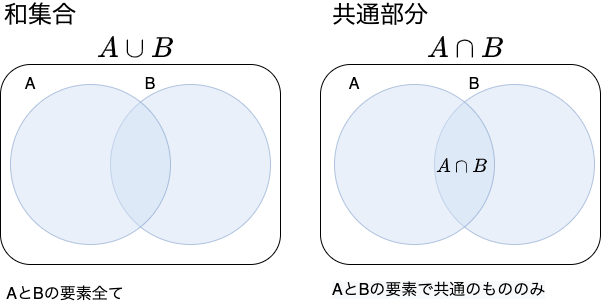
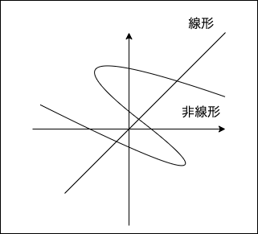

# E 資格まとめ

## 目次

<!-- @import "[TOC]" {cmd="toc" depthFrom=1 depthTo=5 orderedList=false} -->

<!-- code_chunk_output -->

- [E 資格まとめ](#e-資格まとめ)
  - [目次](#目次)
  - [目標](#目標)
  - [本題](#本題)
    - [応用数学](#応用数学)
      - [線形代数](#線形代数)
        - [行列](#行列)
        - [計算方法（２ × ２の正方行列の場合）](#計算方法2-2の正方行列の場合)
        - [単位行列と逆行列](#単位行列と逆行列)
        - [行列式](#行列式)
        - [固有値・固有ベクトル](#固有値固有ベクトル)
        - [固有値分解](#固有値分解)
        - [特異値・特異ベクトル](#特異値特異ベクトル)
      - [統計学](#統計学)
        - [集合](#集合)
        - [確率](#確率)
        - [余事象](#余事象)
        - [条件付き確率とベイズの定理](#条件付き確率とベイズの定理)
        - [統計](#統計)
        - [確率変数と確率分布](#確率変数と確率分布)
        - [期待値](#期待値)
        - [分散と共分散](#分散と共分散)
        - [分散と標準偏差](#分散と標準偏差)
        - [確率分布](#確率分布)
        - [推定・推定量・推定値](#推定推定量推定値)
        - [標本平均](#標本平均)
        - [標本分散と不偏分散](#標本分散と不偏分散)
      - [情報科学](#情報科学)
        - [自己情報量](#自己情報量)
        - [シャノンエントロピー](#シャノンエントロピー)
        - [KL ダイバージェンス](#kl-ダイバージェンス)
        - [交差エントロピー](#交差エントロピー)
    - [機械学習](#機械学習)
      - [線形回帰モデル](#線形回帰モデル)
        - [線形回帰とは](#線形回帰とは)
        - [最小二乗法](#最小二乗法)
        - [最尤法](#最尤法)
        - [ハンズオン](#ハンズオン)
      - [非線形回帰モデル](#非線形回帰モデル)
        - [非線形回帰とは](#非線形回帰とは)
        - [基底関数](#基底関数)
        - [未学習と過学習](#未学習と過学習)
        - [正則化](#正則化)
        - [ホールドアウト法](#ホールドアウト法)
        - [K-分割交差検証](#k-分割交差検証)
        - [ハンズオン](#ハンズオン-1)
      - [ロジスティック回帰モデル](#ロジスティック回帰モデル)
        - [ロジスティック回帰モデルとは](#ロジスティック回帰モデルとは)
        - [シグモイド関数](#シグモイド関数)
        - [最尤推定](#最尤推定)
        - [勾配降下法](#勾配降下法)
        - [勾配降下法のバリエーション](#勾配降下法のバリエーション)
        - [モデルの評価](#モデルの評価)
        - [ハンズオン](#ハンズオン-2)
      - [主成分分析](#主成分分析)
        - [主成分分析とは](#主成分分析とは)
        - [寄与率](#寄与率)
        - [主成分の求め方](#主成分の求め方)
        - [ハンズオン](#ハンズオン-3)
      - [アルゴリズム（k 近傍法、k-means）](#アルゴリズムk-近傍法-k-means)
        - [k 近傍法](#k-近傍法)
        - [ハンズオン](#ハンズオン-4)
        - [k-means](#k-means)
        - [ハンズオン](#ハンズオン-5)
      - [サポートベクターマシン（SVM）](#サポートベクターマシンsvm)
        - [SVM とは](#svm-とは)
        - [サポートベクターとは](#サポートベクターとは)
        - [ソフトマージン SVM](#ソフトマージン-svm)
        - [カーネルトリック](#カーネルトリック)
        - [ハンズオン](#ハンズオン-6)
    - [深層学習](#深層学習)
      - [入力層〜中間層](#入力層中間層)
        - [入力層](#入力層)
        - [中間層](#中間層)
        - [確認テスト](#確認テスト)
        - [確認テスト](#確認テスト-1)
        - [確認テスト](#確認テスト-2)
        - [確認テスト](#確認テスト-3)
        - [確認テスト](#確認テスト-4)
      - [活性化関数](#活性化関数)
        - [活性化関数](#活性化関数-1)
        - [確認テスト](#確認テスト-5)
        - [中間層用の活性化関数](#中間層用の活性化関数)
        - [活性化関数の描画](#活性化関数の描画)
        - [出力層用の活性化関数](#出力層用の活性化関数)
      - [出力層](#出力層)
      - [勾配降下法](#勾配降下法-1)
      - [誤差逆伝播法](#誤差逆伝播法)

<!-- /code_chunk_output -->

## 目標

E 資格の学習項目のまとめ

## 本題

### 応用数学

#### 線形代数

##### 行列

###### 行列

**行列** ： 記号や実数・複素数などの要素を、縦方向と横方向に長方形状（正方形も含む）に並べたもの。

用途は主に次の２つ

- ベクトルの変換
- 連立方程式を解く

横方向を **行**  
縦方向を **列** という。


##### 計算方法（２ × ２の正方行列の場合）


##### 単位行列と逆行列

対角要素がすべて 1 でそのほかの要素がすべて 0 である正方行列のことを **単位行列** という。


行列 A について AX=XA=I となる行列 Y を A の逆行列といい、A<sup>-1</sup>で表す。


##### 行列式

行列式とは正方行列に対して決まるスカラーをいう。


行列が大きくなった際の行列式は余因子展開などで求められる。


取り出した成分の行番号と列番号の和で符号が反転するので注意

- 偶数の時 → プラス

- 奇数の時 → マイナス

行列式の重要な点は以下のこと。

**det(A)=0 のとき,行列 A に逆行列は存在しない。**

##### 固有値・固有ベクトル

ｎ次正方行列 A に対して


となるような定数 λ とベクトル x（ｎ次元の列ベクトル）が存在するとき，  
λ を A の **固有値** といい  
x を λ に属する（に対する） **固有ベクトル** という．

###### 求め方


参考

[固有値，固有ベクトルの求め方](https://www.geisya.or.jp/~mwm48961/linear_algebra/eigenvalue2.htm)

###### 何に使うの？？

機械学習の主成分分析などに使用する。

#####　固有値分解
固有値・固有ベクトルの発展として固有値分解がある。


このような分解を行うことで、行列の累乗計算が楽になる。

##### 特異値・特異ベクトル

正方行列でしか固有値分解はできないが、似たことはできる。  
それを特異値分解（SVD）という。
主に次元削減に使用される。

###### 求め方


#### 統計学

##### 集合

###### 集合とは？？

ものの集まり


###### 和集合と共通部分



###### 絶対補と相対補


##### 確率

###### 頻度確率とベイズ確率

- 頻度確率（客観確率）：発生する頻度
- ベイズ確率（主観確率）：信念の度合い

###### 確率の定義


確率の値は０から１の間となる。

##### 余事象

P(A)が A が起きる確率に対して、A が起きない確率を次のように表す。


##### 条件付き確率とベイズの定理

ある事象が起こるという条件のもとで、別のある事象が起こる確率のことを **条件付き確率** と言う。  
事象 B が起こるという条件のもとで事象 A が起こる場合、この条件付き確率は P(A|B)と表され、次の式により計算できる。


事象 A を原因、事象 B を結果とするとベイズの定理は『結果から原因を探る確率』とも言える。

##### 統計

###### 記述統計と推測統計

- 記述統計：集団の性質を要約し記述する
- 推測統計：集団から一部を取り出し元の集団（母集団）の性質を推測する

##### 確率変数と確率分布

- 確率変数：事象と結び付けられた数値
- 確率分布：事象の発生する確率の分布

##### 期待値

期待値とは、確率変数 X がとる値とその値をとる確率 P の積を全て足し合わせたもので確率変数の平均値を表す。  


##### 分散と共分散

- 分散：データの散らばり具合を表す
  データの各々の値が、期待値からどれだけずれているかを平均化したもの

- 共分散：２つのデータ系列の傾向の違い
  - 正の値：似た傾向
  - 負の値：逆の傾向
  - ゼロ：関係性に乏しい


##### 分散と標準偏差

標準偏差の２乗＝分散となる。  
こうすることで、標準偏差では元のデータと単位が一致する。

##### 確率分布

- ベルヌーイ分布：コインの裏表のような２種類の結果しか得られないような分布

- 二項分布：ベルヌーイ分布に従う試行を N 回行った結果の確率に関する分布

- カテゴリカル分布：サイコロのイメージ（ベルヌーイ分布が二値だったのに対して K 値の場合）

- ガウス分布（正規分布）：平均値と最頻値と中央値が一致するような分布
  - 中心極限定理を知っておくと正規分布の良さがより分かる

##### 推定・推定量・推定値

- 推定：母集団を特徴付ける母数（パラメータ：平均など）を統計的に推測すること。
- 推定量：パラメータを推定するために利用する数値の計算方法や計算式のこと。推定関数ともいう。
- 推定量：実際に試行を行った結果から計算した値

##### 標本平均

- 標本平均：母集団から取り出した標本の平均
  サンプルを沢山取れば母集団の値に近づく → 一致性
  サンプル数がいくらであっても、その期待値は母集団の値と同じ → 不偏性

##### 標本分散と不偏分散

- 標本分散：標本から計算した分散
- 不偏分散：標本分散が母分散に等しくなるように補正したもの

#### 情報科学

##### 自己情報量

- 対数の底が２のとき、単位はビット（bit）
- 対数の底がネイピアの e のとき、単位は（nat）

P(x)の確率で起きる事象 x の自己情報量は以下の式で定義される。log の底を 2 にして bits で表すのが一般的。


##### シャノンエントロピー

- 自己情報量の期待値
- 微分エントロピーともいう（微分はしてないのに）


##### KL ダイバージェンス

- ２つの確率分布がどの程度似ているかを表す指標。
- 相対エントロピーともいう。


##### 交差エントロピー

- KL ダイバージェンスの一部分を取り出したもの。
- Q についての自己情報量を P の分布で平均している。

P と Q が似た分布のとき、交差エントロピーの値は小さくなる。

### 機械学習

#### 線形回帰モデル

##### 線形回帰とは

データの分布を直線によって表現する手法。  
最も簡単な例では、ある入力 X（説明変数または特徴量という）が与えられたとき、その予測値 y（目的変数）を  
**y ＝ aX ＋ b**  
の形で表現する。  
この時の、最適なパラメータ（ここでは a,b）を求めるのが課題となる。  
予測値には慣例として **ハット（^）** を付ける。

##### 最小二乗法

最適なパラメータの決め方の一つ。  
最小二乗法では、実際のデータと予測値の差の二乗（二乗誤差）が最小になるようにパラメータを調整する。
差の二乗を取るのは計算のコストを下げるため。

##### 最尤法

最適なパラメータの決め方の一つ。  
誤差を正規分布に従う確率変数を仮定し尤度関数の最大化を利用した推定。  
回帰の場合には、最尤法による解は最小二乗法の解と一致

##### ハンズオン

- 設定
  - ボストンの住宅データセットを線形回帰モデルで分析
- 課題
  - 部屋数が 4 で犯罪率が 0.3 の物件はいくらになるか？
- 回答
  - 4.24007956

[演習結果](../pdf/linear_regression.pdf "演習結果")

#### 非線形回帰モデル

##### 非線形回帰とは

データの構造を線形で表現できる場合は限られているので、非線形な構造も表現できるような仕組み。

##### 基底関数

回帰関数として、基底関数と呼ばれる既知の非線形関数とパラメータベクトルの線形結合を使用する。
未知のパラメータは最小二乗法や最尤法により推定する。

よく使われる基底関数は以下のようなものがある。

- 多項式関数
- ガウス型基底関数
- スプライン関数/B スプライン関数

##### 未学習と過学習

- 未学習（underfitting）：学習データに対して十分小さな誤差が得られないモデル

- 過学習（overfitting）：学習データに対しては誤差が小さいが、テストデータでの誤差が大きくなっているモデル

過学習の対策としては以下のようなものがある

- 学習するデータの数を増やす
- 不要な基底関数（変数）を削除して表現力を抑止
- 正則化法を利用して表現力を抑止

##### 正則化

- L1 正則化（Lasso）：いくつかの係数を完全にゼロにする
- L2 正則化（Ridge）：係数の絶対値を縮小する

どちらも、パラメータを変化させることでモデルの表現力を抑止している

##### ホールドアウト法

有限のデータを学習用とテスト用の２つに分割し、「予測精度」や「誤り率」を推定するのに使用する。  
手元に大量のデータが無いと良い性能評価を与えないという欠点がある

##### K-分割交差検証

K-分割交差検証は、データを K 個に分割してそのうち 1 つをテストデータに残りの K-1 個を学習データとして正解率の評価を行う。  
これを K 個のデータすべてが 1 回ずつテストデータになるように K 回学習を行なって精度の平均をとる手法のこと。  
ただし、複数回の学習が必要なので処理時間が長くなる。

##### ハンズオン

[演習結果](../pdf/nonlinear_regression.pdf "演習結果")

#### ロジスティック回帰モデル

##### ロジスティック回帰モデルとは

**分類** のタスクを解くためのアルゴリズム

ある入力（数値）からクラスに分類する問題

##### シグモイド関数


- 入力は実数。出力は必ず 0〜1 の値
- （クラス１に分類される）確率を表現
- 単調増加関数
- パラメータが変わると関数の形が変わる
  - a を増加させると、x=0 付近での曲線の勾配が増加
  - a を極めて大きくすると単位ステップ関数に近づく
  - バイアス変化は段差の位置
- シグモイド関数の微分は、シグモイド関数自身で表現することが可能
- 出力結果を確率で表し、結果が 0.5 以上なら 1、それ未満なら 0 として分類問題を推定


##### 最尤推定

- 尤度：結果から分布のパラメータがどれほど有り得そうかを表したもの
- 最尤推定:尤も有り得そうなパラメータを推定する手法

##### 勾配降下法

- 反復学習によりパラメータを逐次的に更新するアプローチの一つ

##### 勾配降下法のバリエーション

| アルゴリズム            | 特徴                                                   | メリット                                   | デメリット |
| ----------------------- | ------------------------------------------------------ | ------------------------------------------ | ---------- |
| バッチ勾配降下法        | 全ての訓練データを使用して勾配を計算                   | 安定している                               | 遅い       |
| 確率的勾配降下法（SGD） | ランダムに１個のデータを選んで勾配を計算               | ・ 速い <br> ・ 全体の最小値を見つけやすい | 不規則     |
| ミニバッチ勾配降下法    | ランダムに選んだ小さなデータの集合を使用して勾配を計算 | ・速い<br>・安定した最小値にたどり着ける   | 特になし   |

##### モデルの評価

- 正解率：予測に対する結果が正しいかどうかの指標
- 適合率：ミスを許容し、誤判定を許容しない場合の指標(迷惑メール)
- 再現率：ミスを許容せず、誤判定を許容する場合の指標(がん検診)
- F 値：適合率と再現率はトレードオフのため、見逃しと誤判定の最適値を適用する際の指標

##### ハンズオン

- 設定
  - タイタニックの乗客データを利用しロジスティック回帰モデルを作成
- 課題
  - 年齢が 30 歳で男の乗客は生き残れるか?
- 回答
  - 生き残れない

[演習結果](../pdf/logistic_regression.pdf "演習結果")

#### 主成分分析

##### 主成分分析とは

- 教師なし学習
  - データの本質的な構造を理解する
  - 教師あり学習の前段階としてラベル付けを行う
- 多変量データの持つ構造をより少数個の指標に圧縮
  - 変量の個数を減らすことに伴う、情報の損失をなるべく小さくしたい
  - 少数変数を利用した分析や可視化（２・３次元）が実現可能
  - ２次元・３次元に次元を落とし込むのが主成分分析というわけではない（１００次元から１０次元の圧縮も主成分分析という）

##### 寄与率

- 各主成分の重要性を示す
- 各主成分によって説明できるデータの割合を示す
  - 全ての寄与率を足すと１.0 になる
- 累積寄与率
  - 主成分の寄与率を足し合わせたもの

##### 主成分の求め方

1. 分散共分散行列を計算
2. 固有値問題を解く
3. 固有ベクトルが主成分となる

##### ハンズオン

- 設定
  - 乳がん検査データを利用しロジスティック回帰モデルを作成
  - 主成分を利用し 2 次元空間上に次元圧縮
- 課題
  - 32 次元のデータを 2 次元上に次元圧縮した際に、うまく判別できるかを確認
- うまく判別できる（スコアの差が僅かなため）

[演習結果](../pdf/principal_component_analysis.pdf "演習結果")

#### アルゴリズム（k 近傍法、k-means）

##### k 近傍法

- 分類問題のための機械学習手法
- 最近傍のデータを k 個取ってきて、それらが最も多く所属するクラスに識別する
- k を大きくすると決定境界は滑らかになる

##### ハンズオン

[演習結果](../pdf/Knn.pdf "演習結果")

##### k-means

- 教師なし学習
- クラスタリング手法
- 与えられたデータを k 個のクラスタに分類する
- 各クラスタ中心の初期値を変えるとクラスタリング結果も変わる
- k の値を変えるとクラスタリングの結果も変わる
- k の値は事前に決めるものだが、最適な k を決めるものもある（x-means）

##### ハンズオン

[演習結果](../pdf/k-means.pdf "演習結果")

#### サポートベクターマシン（SVM）

##### SVM とは

- 「マージン最大化」と呼ばれる考えに基づき、主に２値の分類問題に使用される（多クラス分類や回帰問題への拡張も可能）
- 計算コストが比較的大きいため、大規模なデータセットには適していない

##### サポートベクターとは

- データを分割する直線に最も近いデータ点の事

##### ソフトマージン SVM

- サンプルを線形分離できないとき
- 誤差を許容し、誤差に対してペナルティを与える
- 線形分離できない場合でも対応
- パラメータ C の大小で決定境界が変化

##### カーネルトリック

- 高次元ベクトルの内積をスカラー関数で表現
- 特徴空間が高次元でも計算コストを抑えられる

##### ハンズオン

[演習結果](../pdf/SVM.pdf "演習結果")

### 深層学習

#### 入力層〜中間層

##### 入力層

- ニューラルネットワークに与えるデータ
  - 動物の分類なら（体長,体重,足の長さ,etc...）
- 解決したいタスクに適したデータを選択すること

##### 中間層

- 隠れ層ともいう
- ここの層を増やすことで NN の精度を向上させていく

##### 確認テスト

問：
ディープラーニングは、何をやろうとしているのか２行以内で述べよ。
また、どの値の最適化が最終目的か。
回答：
誤差を最小化するパラメータを発見すること。
値の最適化 → 重み、バイアス

##### 確認テスト

問：次のネットワークを図示せよ

- 入力層：２ノード１層
- 中間層：３ノード２層
- 出力層：１ノード１層

回答：


##### 確認テスト

問：動物分類の実例を図式化してみる

回答：


##### 確認テスト
問：下記の数式を Python で書いてみる  

u = w<sub>1</sub>x<sub>1</sub>+w<sub>2</sub>x<sub>2</sub>+w<sub>3</sub>x<sub>3</sub>+w<sub>4</sub>x<sub>4</sub> + b
= Wx + b

回答：

```Python
import numpy as np

# dot は 内積
# 次元の扱いに注意
u = np.dot(x, W_1) + b_1
```

##### 確認テスト
問：中間層を表すコードを抜き出す
回答：


```Python
# 中間層出力
z = functions.relu(u)
print_vec("中間層出力", z)
```

#### 活性化関数

##### 活性化関数
- NNにおいて、次の層での出力の大きさを決める非線形の関数
- 入力値の値によって、次の層への信号のON/OFFや強弱を定める働きを持つ

##### 確認テスト

問：線形と非線形の違いを図にかいて簡易に説明せよ。

回答：線形は比例関係が成り立っているもの、非線形はそうでないもの



##### 中間層用の活性化関数

- ステップ関数
  - ディープラーニングでは、ほぼ使用されていない
  - 閾値を超えたら発火する関数であり、出力は常に０か１
  - パーセプトロンで使用された関数
  - 課題：０−１の間を表現できず、線形分離可能なものしか学習できなかった

```python
def step_function(x):
  if x > 0:
    return 1
  else:
    return 0
```

- シグモイド（ロジスティック）関数
  - 0 ~ 1の間を緩やかに変化する関数で、ステップ関数ではON/OFFしかない状態に対し、信号の強弱を伝えられるようになりニューラルネットワーク普及のきっかけとなった
  - 課題：大きな値では出力の変化が微小なため、勾配消失問題を引き起こす事があった

```python
def sigmoid(x):
  return 1/(1 + np.exp(-x))
```

- ReLU関数
  - 今最も使われている活性化関数
  - 勾配消失問題の回避とスパース化に貢献することで良い成果をもたらしている
  - 一般的によく使われている関数であるが、必ずしも最適とは限らない

```python
def relu(x):
  return np.maximum(0, x)
```

##### 活性化関数の描画

[活性化関数の描画](../pdf/activation_function.pdf "活性化関数の描画")

##### 出力層用の活性化関数

- ソフトマックス関数
- 恒等写像
- シグモイド関数（ロジスティック関数）

#### 出力層

#### 勾配降下法

#### 誤差逆伝播法
