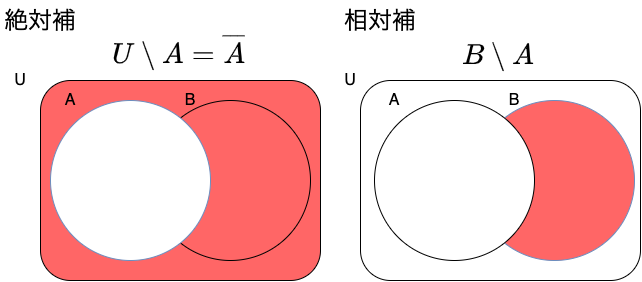

# E 資格まとめ {ignore=true}

## 目次 {ignore=true}

<!-- @import "[TOC]" {cmd="toc" depthFrom=1 depthTo=5 orderedList=false} -->

<!-- code_chunk_output -->

- [目標](#目標)
- [本題](#本題)
  - [応用数学](#応用数学)
    - [線形代数](#線形代数)
      - [行列](#行列)
      - [計算方法（２×２の正方行列の場合）](#計算方法22の正方行列の場合)
      - [単位行列と逆行列](#単位行列と逆行列)
      - [行列式](#行列式)
      - [固有値・固有ベクトル](#固有値固有ベクトル)
      - [固有値分解](#固有値分解)
      - [特異値・特異ベクトル](#特異値特異ベクトル)
    - [統計学](#統計学)
      - [集合](#集合)
      - [確率](#確率)
      - [余事象](#余事象)
      - [条件付き確率とベイズの定理](#条件付き確率とベイズの定理)
      - [統計](#統計)
      - [確率変数と確率分布](#確率変数と確率分布)
      - [期待値](#期待値)
      - [分散と共分散](#分散と共分散)
      - [分散と標準偏差](#分散と標準偏差)
      - [確率分布](#確率分布)
      - [推定・推定量・推定値](#推定推定量推定値)
      - [標本平均](#標本平均)
      - [標本分散と不偏分散](#標本分散と不偏分散)
    - [情報科学](#情報科学)
      - [自己情報量](#自己情報量)
      - [シャノンエントロピー](#シャノンエントロピー)
      - [KLダイバージェンス](#klダイバージェンス)
      - [交差エントロピー](#交差エントロピー)
  - [機械学習](#機械学習)
    - [線形回帰モデル](#線形回帰モデル)
    - [非線形回帰モデル](#非線形回帰モデル)
    - [ロジスティック回帰モデル](#ロジスティック回帰モデル)
    - [主成分分析](#主成分分析)
    - [アルゴリズム（k 近傍法、k-means）](#アルゴリズムk-近傍法-k-means)
    - [サポートベクターマシン（SVM）](#サポートベクターマシンsvm)
  - [深層学習](#深層学習)
    - [入力層〜中間層](#入力層中間層)
    - [活性化関数](#活性化関数)
    - [出力層](#出力層)
    - [勾配降下法](#勾配降下法)
    - [誤差逆伝播法](#誤差逆伝播法)

<!-- /code_chunk_output -->

## 目標

E 資格の学習項目のまとめ

## 本題

### 応用数学

#### 線形代数

##### 行列

###### 行列

**行列** ： 記号や実数・複素数などの要素を、縦方向と横方向に長方形状（正方形も含む）に並べたもの。

用途は主に次の２つ

- ベクトルの変換
- 連立方程式を解く

横方向を **行**  
縦方向を **列** という。

##### 計算方法（２×２の正方行列の場合）

##### 単位行列と逆行列

対角要素がすべて 1 でそのほかの要素がすべて 0 である正方行列のことを **単位行列** という。

行列 A について AX=XA=I となる行列 Y を A の逆行列といい、A-1で表す。

##### 行列式

行列式とは正方行列に対して決まるスカラーをいう。

行列が大きくなった際の行列式は余因子展開などで求められる。

取り出した成分の行番号と列番号の和で符号が反転するので注意

* 偶数の時→プラス

* 奇数の時→マイナス

行列式の重要な点は以下のこと。

__det(A)=0のとき,行列Aに逆行列は存在しない。__

##### 固有値・固有ベクトル

ｎ次正方行列Aに対して

となるような定数λとベクトルx（ｎ次元の列ベクトル）が存在するとき，  
λをAの __固有値__ といい  
xをλに属する（に対する） __固有ベクトル__ という．

###### 求め方

参考

[固有値，固有ベクトルの求め方](https://www.geisya.or.jp/~mwm48961/linear_algebra/eigenvalue2.htm)

###### 何に使うの？？
機械学習の主成分分析などに使用する。

#####　固有値分解
固有値・固有ベクトルの発展として固有値分解がある。

このような分解を行うことで、行列の累乗計算が楽になる。

##### 特異値・特異ベクトル
正方行列でしか固有値分解はできないが、似たことはできる。  
それを特異値分解（SVD）という。
主に次元削減に使用される。

###### 求め方

#### 統計学

##### 集合
###### 集合とは？？
ものの集まり

###### 和集合と共通部分

###### 絶対補と相対補

##### 確率

###### 頻度確率とベイズ確率

- 頻度確率（客観確率）：発生する頻度
- ベイズ確率（主観確率）：信念の度合い

###### 確率の定義

確率の値は０から１の間となる。

##### 余事象
P(A)がAが起きる確率に対して、Aが起きない確率を次のように表す。

##### 条件付き確率とベイズの定理
ある事象が起こるという条件のもとで、別のある事象が起こる確率のことを __条件付き確率__ と言う。  
事象Bが起こるという条件のもとで事象Aが起こる場合、この条件付き確率はP(A|B)と表され、次の式により計算できる。

事象Aを原因、事象Bを結果とするとベイズの定理は『結果から原因を探る確率』とも言える。

##### 統計

###### 記述統計と推測統計
- 記述統計：集団の性質を要約し記述する
- 推測統計：集団から一部を取り出し元の集団（母集団）の性質を推測する

##### 確率変数と確率分布

- 確率変数：事象と結び付けられた数値
- 確率分布：事象の発生する確率の分布

##### 期待値

期待値とは、確率変数Xがとる値とその値をとる確率Pの積を全て足し合わせたもので確率変数の平均値を表す。  

##### 分散と共分散
- 分散：データの散らばり具合を表す
  データの各々の値が、期待値からどれだけずれているかを平均化したもの

- 共分散：２つのデータ系列の傾向の違い
  - 正の値：似た傾向
  - 負の値：逆の傾向
  - ゼロ：関係性に乏しい

##### 分散と標準偏差
標準偏差の２乗＝分散となる。  
こうすることで、標準偏差では元のデータと単位が一致する。

##### 確率分布

- ベルヌーイ分布：コインの裏表のような２種類の結果しか得られないような分布

- 二項分布：ベルヌーイ分布に従う試行をN回行った結果の確率に関する分布

- カテゴリカル分布：サイコロのイメージ（ベルヌーイ分布が二値だったのに対してK値の場合）

- ガウス分布（正規分布）：平均値と最頻値と中央値が一致するような分布
  - 中心極限定理を知っておくと正規分布の良さがより分かる

##### 推定・推定量・推定値
- 推定：母集団を特徴付ける母数（パラメータ：平均など）を統計的に推測すること。
- 推定量：パラメータを推定するために利用する数値の計算方法や計算式のこと。推定関数ともいう。
- 推定量：実際に試行を行った結果から計算した値

##### 標本平均
- 標本平均：母集団から取り出した標本の平均
サンプルを沢山取れば母集団の値に近づく → 一致性
サンプル数がいくらであっても、その期待値は母集団の値と同じ → 不偏性

##### 標本分散と不偏分散
- 標本分散：標本から計算した分散
- 不偏分散：標本分散が母分散に等しくなるように補正したもの

#### 情報科学

##### 自己情報量

- 対数の底が２のとき、単位はビット（bit）
- 対数の底がネイピアのeのとき、単位は（nat）

P(x)の確率で起きる事象xの自己情報量は以下の式で定義される。logの底を2にしてbitsで表すのが一般的。

##### シャノンエントロピー
- 自己情報量の期待値
- 微分エントロピーともいう（微分はしてないのに）

##### KLダイバージェンス
- ２つの確率分布がどの程度似ているかを表す指標。
- 相対エントロピーともいう。

##### 交差エントロピー
- KLダイバージェンスの一部分を取り出したもの。
- Qについての自己情報量をPの分布で平均している。

PとQが似た分布のとき、交差エントロピーの値は小さくなる。

### 機械学習

#### 線形回帰モデル

#### 非線形回帰モデル

#### ロジスティック回帰モデル

#### 主成分分析

#### アルゴリズム（k 近傍法、k-means）

#### サポートベクターマシン（SVM）

### 深層学習

#### 入力層〜中間層

#### 活性化関数

#### 出力層

#### 勾配降下法

#### 誤差逆伝播法
