# E 資格まとめ {ignore=true}

## 目次 {ignore=true}

<!-- @import "[TOC]" {cmd="toc" depthFrom=1 depthTo=6 orderedList=false} -->

<!-- code_chunk_output -->

- [目標](#目標)
- [本題](#本題)
  - [深層学習](#深層学習)
    - [勾配消失問題](#勾配消失問題)
      - [確認テスト](#確認テスト)
      - [勾配消失問題とは](#勾配消失問題とは)
      - [勾配消失問題の解決策](#勾配消失問題の解決策)
      - [確認テスト](#確認テスト-1)
      - [1. 活性化関数の選択](#1-活性化関数の選択)
      - [2. 重みの初期値設定](#2-重みの初期値設定)
      - [確認テスト](#確認テスト-2)
      - [3. バッチ正規化](#3-バッチ正規化)
      - [演習](#演習)
    - [学習率最適化手法](#学習率最適化手法)
      - [モメンタム](#モメンタム)
      - [AdaGrad](#adagrad)
      - [RMSProp](#rmsprop)
      - [Adam](#adam)
      - [演習](#演習-1)
    - [過学習](#過学習)
      - [過学習の原因](#過学習の原因)
      - [確認テスト](#確認テスト-3)
      - [過学習の対策](#過学習の対策)
      - [確認テスト](#確認テスト-4)
      - [演習](#演習-2)
    - [畳み込みニューラルネットワークの概念](#畳み込みニューラルネットワークの概念)
      - [演習](#演習-3)
    - [最新の CNN](#最新の-cnn)
    - [再帰型ニューラルネットワークの概念](#再帰型ニューラルネットワークの概念)
      - [RNNとは](#rnnとは)
      - [時系列データとは](#時系列データとは)
      - [BPTT(Backpropagation Through Time)](#bpttbackpropagation-through-time)
    - [LSTM](#lstm)
      - [RNNの課題](#rnnの課題)
      - [勾配爆発](#勾配爆発)
      - [CEC](#cec)
      - [入力ゲートと出力ゲート](#入力ゲートと出力ゲート)
      - [忘却ゲート](#忘却ゲート)
      - [覗き穴結合](#覗き穴結合)
    - [GRU](#gru)
    - [双方向 RNN](#双方向-rnn)
    - [Seq2Seq](#seq2seq)
      - [Encoder RNN](#encoder-rnn)
      - [Decoder RNN](#decoder-rnn)
      - [HRED](#hred)
      - [VHRED](#vhred)
      - [seq2seqとHREDの違い](#seq2seqとhredの違い)
      - [HREDとVHREDの違い](#hredとvhredの違い)
      - [VAE](#vae)
    - [Word2vec](#word2vec)
    - [Attention Mechanism](#attention-mechanism)
      - [RNNとword2veqの違い](#rnnとword2veqの違い)
      - [seq2seqとAttentionの違い](#seq2seqとattentionの違い)
    - [Tensorflow の実装演習](#tensorflow-の実装演習)
      - [線形回帰](#線形回帰)
      - [非線形回帰](#非線形回帰)
      - [Mnist](#mnist)
    - [強化学習](#強化学習)
      - [強化学習とは](#強化学習とは)
      - [探索と利用のトレードオフ](#探索と利用のトレードオフ)
      - [強化学習の差分](#強化学習の差分)
      - [強化学習の歴史](#強化学習の歴史)
      - [行動価値関数](#行動価値関数)
      - [方策勾配法](#方策勾配法)

<!-- /code_chunk_output -->

## 目標

E 資格の学習項目のまとめ

## 本題

### 深層学習

#### 勾配消失問題

##### 確認テスト
問：連鎖律の原理を使い、dz/dxを求めよ

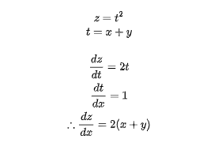

##### 勾配消失問題とは

誤差逆伝播法が下位層(出力層から入力層)に向かって進んでいくにつれて勾配がどんどん緩やかになっていく  
そのため、勾配降下法による更新では下位層のパラメータはほとんど変わらず訓練は最適値に収束しなくなる

##### 勾配消失問題の解決策

1. 活性化関数の選択
2. 重みの初期値設定
3. バッチ正規化

##### 確認テスト
問：シグモイド関数を微分した時、入力値が0の時に最大値をとる。その値は？

回答：

sigmoidの微分は下記  
(sigmoid)′=(1−sigmoid)(sigmoid)  
sigmoid関数は0.5で最大値を取るので  
(sigmoid)′=(1−0.5)(0.5)=0.25となる  

##### 1. 活性化関数の選択

ReLU 関数を使用する  
勾配消失問題とスパース化に貢献することで良い成果をもたらしている

##### 2. 重みの初期値設定

- Xavier：重みの要素を前の層のノード数 n に対して、平均 0、標準偏差が 1/√n である正規分布から重みを設定する手法

- He：ReLU 関数に付随させ、よりもっと勾配消失を起こさないようにする。重みの要素を、ノード数 n に対して、平均 0、標準偏差が √2/n である正規分布から重みを設定

##### 確認テスト
問： 重みの初期値に 0 を設定すると、どのような問題が発生するか？  
回答：すべての値(次に伝播する値)が同じ値で伝わるため、パラメータチューニング行われなくなる  

##### 3. バッチ正規化

ミニバッチ単位へ入力値のデータの偏りを抑制する手法
活性化関数に値を渡す前後にバッチ正規化の処理を孕んだ層を加える
バッチ正規化の効果

1. 計算の高速化
2. 勾配消失が起こりづらくなる

##### 演習

[演習結果](../pdf/vanishing_gradient.pdf "演習結果")

#### 学習率最適化手法

学習率の決め方

- 大きすぎる：最適値にいつまでもたどり着かず、発散する
- 小さすぎる：収束するまで時間がかか利、大域局所最適値に収束しづらくなる

学習率最適化手法を利用して学習率を最適化する  
以下の４つについてまとめる

- モメンタム
- AdaGrad
- RMSProp
- Adam

##### モメンタム

誤差をパラメータで微分したものと学習率の積を減算した後、現在の重みに前回の重みを減算した値と慣性（0.05-0.09）の積を加算する
局所的最適解にならず、大域的最適解となる
谷間についてから最も低い位置(最適値)にいくまでの時間が早い

##### AdaGrad

学習が進むにつれて、学習係数を減衰させる手法。最初は大きく学習し、次第に小さく学習する。

##### RMSProp

Adagrad では学習が進むにつれて学習係数が小さくなってしまう問題があり、それを回避する手法。  
Adagrad の問題だった学習が進むにつれて分母の合計値は増えていき学習係数が 0 に近づいていくことを過去何回かの合計値を近似する指数移動平均を使用することで解消する。

##### Adam

移動平均で振動を抑制するモーメンタム と 学習率を調整して振動を抑制する RMSProp を組み合わせている

##### 演習

[演習結果](../pdf/optimizer.pdf "演習結果")

#### 過学習

テスト誤差と訓練誤差とで、学習曲線が乖離すること。  
特定の訓練サンプルに対して、特化して学習してしまうこと。  
原因：パラメータの数が多い、パラメータの値が適切でない、ノードが多いなど  
⇒ ネットワークの自由度が高いともいえる

##### 過学習の原因

- パラメータを大量に持ち、表現力の高いモデルである事
- 訓練データが少ない事

##### 確認テスト
問：機械学習の線形モデルの正則化はモデルの重みを制限することで可能になる。線形モデルの正則化手法の中にリッジ回帰という手法がある、その特徴は？

回答：ハイパーパラメータを大きな値に設定すると、すべての重みが限りなく0に近づく

##### 過学習の対策

- 正則化
ネットワークの自由度(層数、ノード数、パラメータ値etc...)を制約すること

- Weight decay
重みが大きい値をとることで、過学習が発生することがある  
誤差に対して、正則化項を加算することで、重みを抑制  
過学習がおこりそうな重みの大きさ以下で、  
重みをコントロールし、かつ重みの大きさにばらつきを出す必要がある

- ドロップアウト
ランダムにノードを削除して学習させること  
データ量を変化させずに、異なるモデルを学習させていると解釈できる

##### 確認テスト

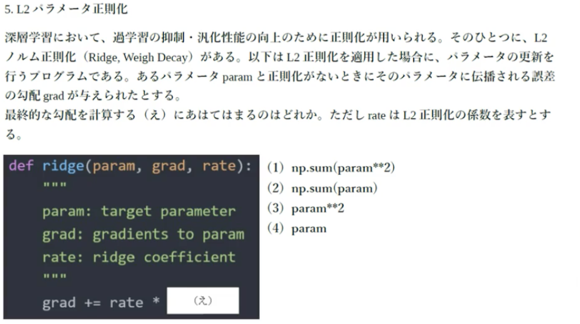

回答：４ (param)  
L2ノルムは||param||^2である。paramで微分して勾配を求めると2*param。  
paramの係数である2は正則化の係数に吸収されても変わらないため、paramが正解。  

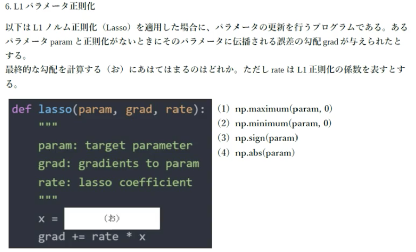

回答：3 sign(param)  
L1ノルムの正則化項は|param|。絶対値の勾配と考えるとsign(param)となる  

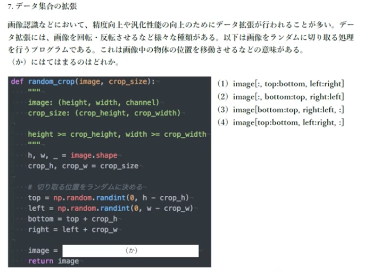

回答：4 image[top:bottom, left:right, :]  
top:bottomは画像の上から下を定義、left:rightは幅を定義、:は全ての色をそのまま利用することを表している。  
imageの形式が(縦幅、横幅、チャンネル)であることを前提としている。

##### 演習

[演習結果](../pdf/overfiting.pdf "演習結果")

#### 畳み込みニューラルネットワークの概念
- 画像処理の分野で注目
- 音声データのような時系列データも加工次第で可能
- 新しい概念として `畳み込み層` `プーリング層`が登場
- 畳み込み層の全体像：入力値×フィルター(全結合でいう重み)→出力値＋バイアス→活性化関数→出力値

##### 演習

[演習結果](../pdf/simple_convolution_network.pdf "演習結果")

#### 最新の CNN

- AlexNet
  - 2012年に開かれた画像認識コンペティションでダントツ1位になったモデル
  - ディープラーニングを採用
- 構造
  - 5層の畳み込み層およびプーリング層など、それに続く3層の全結合層から構成される。
- 過学習を防ぐ施策
  - サイズ4096の全結合層の出力にドロップアウトを使用している。
- 論文の注意点
  - 実験方法などは載っていないことが多い
  - 想像で補い、自分で試して見ることも重要

#### 再帰型ニューラルネットワークの概念

##### RNNとは

時系列データに対応可能な、ニューラルネットワーク

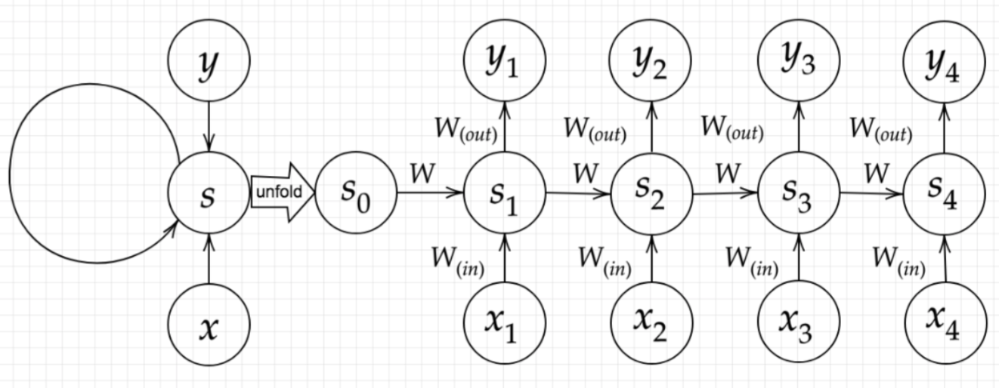

- 一個前の層の出力値に重みが掛け合わされた値が次の層に影響を与える
- 最初の層に関しては自身の層の出力値が前の層の出力値の役割をはたす
- 初期の状態と過去の時間の状態を保持
- 上記のデータから次の時間でのtを再起的に求める再起構造が必要

##### 時系列データとは

時間的順序を追って一定間隔ごとに観察され，相互に統計的依存関係が認められるようなデータの系列

##### BPTT(Backpropagation Through Time)

- RNNにおけるパラメータ調整方法の一種
- 誤差逆伝播の一種

#### LSTM

##### RNNの課題

- 時系列を遡れば遡るほど勾配が消失していく
  - 長い時系列の学習が難しい
- 解決策
  - 構造自体を変える→LSTM

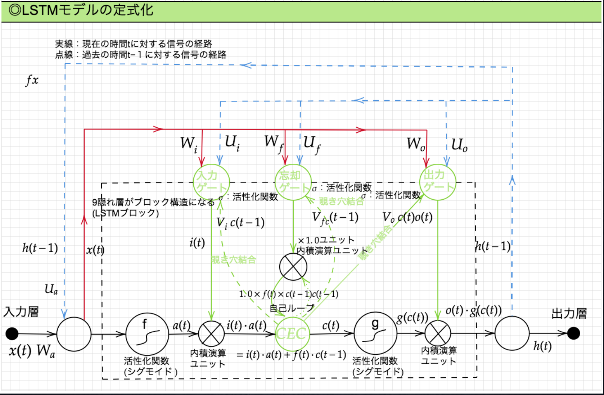

##### 勾配爆発

- 勾配が層を逆伝播するごとに指数関数的に大きくなっていくこと
  - ReLU関数を活性化関数を利用した際に発生することがある

##### CEC

- 勾配消失&勾配爆発は勾配が1であれば解決

課題
- 入力データについて時間依存度に関係なく重みが一律
- モデルが学習がしない

##### 入力ゲートと出力ゲート

それぞれのゲートへの入力値の重みを重み行列W,Uで可変にする→CECの課題(重みが一律)を解決

##### 忘却ゲート

CECは過去の全ての情報が全て保管されている

- 課題
  - いらない情報も削除できず、保管され続ける

- 解決策
  - いらなくなった情報は削除する→忘却ゲートの役割

##### 覗き穴結合

- CECの課題
  - CECに保存されている過去の情報を任意のタイミングで他のノードに伝播させたり、忘却させたい
  - CEC自身の値はゲート制御に影響を与えていない
- 覗き穴結合とは
  - 自身の値に重み行列を介して電伝播可能にした構造

#### GRU

- LSTMの課題
  - パラメータ数が多く、計算負荷が高い
  - 学習に時間がかかる
- GRUとは
  - LSTMからパラメータを大幅に削減
  - 精度はLSTM以上が望める
- 構造
  - リセットゲート：過去の記録を忘却させるのか保持し続けるのかを制御するゲート
  - 更新ゲート：過去の状態から伝達された長期記憶と現在の状態から作り出された記憶を混合して新しい長期記憶を作り出すゲート
- 注意点
  - 完全な上位互換ではなくLSTMの方が優れている状況もある

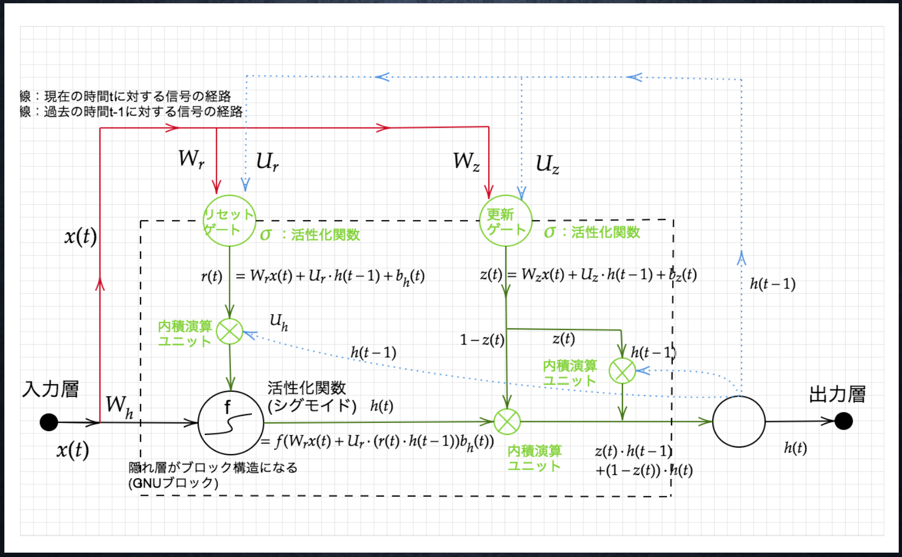

#### 双方向 RNN

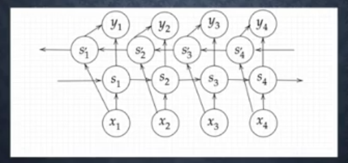

過去の情報だけでなく、未来の情報を加味することで、精度を向上させるためのモデル

実用例文章の推敲や、機械翻訳等

#### Seq2Seq

Encoder-Decoderモデルの一種

- 用途
  - 機械対話
  - 機械翻訳

##### Encoder RNN

- ユーザーがインプットしたテキストデータを、単語等のトークンに区切って渡す構造
- Taking :文章を単語等のトークン毎に分割し、トークンごとのIDに分割する。
- Embedding :IDから、そのトークンを表す分散表現ベクトルに変換。
- Encoder RNN:ベクトルを順番にRNNに入力していく。
- Encoder RNN処理手順
  - vec1をRNNに入力し、hidden stateを出力。このhiddenstateと次の入力vec2をまたRNNに入力してきたhidden stateを出力という流れを繰り返す。
  - 最後のvecを入れたときのhiddenstateをfinalstateとしてとっておく。このfinalstateがthoughtvectorと呼ばれ、入力した文の意味を表すベクトルとなる

##### Decoder RNN

- システムがアウトプットデータを、単語等のトークンごとに生成する構造。
- Decoder RNNの処理
  - Decoder RNN: Encoder RNN のfinal state (thought vector) から、各token の生成確率を出力していきますfinal state をDecoder RNN のinitial state ととして設定し、Embedding を入力。
  - Sampling:生成確率にもとづいてtoken をランダムに選びます。
  - Embedding:2で選ばれたtoken をEmbedding してDecoder RNN への次の入力とします。
  - Detokenize:1 -3 を繰り返し、2で得られたtoken を文字列に直します。

##### HRED

- Seq2seqの課題
  - 一問一答しかできない
  - 問いに対して文脈なく、単純な応答しかできない
  - 文脈に即した回答ができない
- 特徴
  - 過去のn-1個の発話から次の発話を生成する
  - 文脈を加味した反応
- 構造
  - Seq2seq + Context RNN
- Context RNN
  - Encoderのまとめた各文章の系列をまとめて、これまでの会話コンテキスト全体を表すベクトルに変換する構造
  - 過去の発話の履歴を加味した返答が可能になる
- 課題
  - 出力される会話の流れが毎回同じようなものになってしまう
  - 短く情報量が乏しい出力になることが多い

##### VHRED

- HREDにVAEの潜在変数の概念を組み合わせたもの
- HREDの課題を解決できる

##### seq2seqとHREDの違い

一問一答か文脈を加味した返答ができるかの違い

##### HREDとVHREDの違い

返答が毎回同じようなものになるかならないかの違い

##### VAE

- オートエンコーダ
- 教師なし学習
- 次元圧縮のためのアルゴリズム
  - 入力されたデータに次元削減の処理をして、特徴抽出する
- 構造
  - Encoder:入力データから潜在変数zに変換するニューラルネットワーク
  - Decoder:潜在変数zをインプットとして元画像を復元するニューラルネットワーク
- メリット
  - 次元削減が可能
- VAEとは
  - データを潜在変数zの確率分布という構造に押し込める

潜在変数zの確率分布と文脈のデータを組み合わせた出力を行うということが大きなポイント

#### Word2vec

- RNNの課題
  - 可変長の文字列をNNに与えられない→固定長形式で単語を表す必要があった
- 特徴
  - 学習データからボキャブラリ(辞書)を作成
  - 重みの生成方法が超効率的である
- メリット
  - 大規模データの分散表現の学習を現実的な計算速度とメモリ量で実現可能にした
  - 以前：ボキャブラリ数*ボキャブラリ数
  - word2vec:ボキャブラリ*任意の単語ベクトル

#### Attention Mechanism

「入力と出力のどの単語が関連しているのか」の関連度を学習する仕組み

- seq2seqの課題 
- 内容
  - どんな単語数でも固定次元ベクトルの中に入力する必要がある
- 解決策
  文章の長さに応じてシーケンスの内部表現を変える仕組みを作る→Attention Mechanis

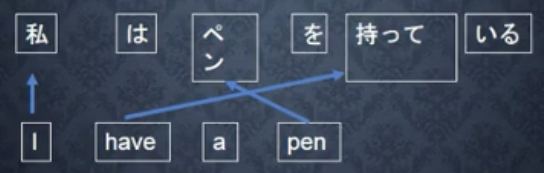

「I」は「私」と関連度が高いが、「a」は出力結果のどれwordとも関連度が低い。このような入力と出力の単語の関連度合いを学習するのがAttention Mechanism

##### RNNとword2veqの違い

RNNはボキャブラリ数ボキャブラリ数の重み（パラメータ）が生成されるのに対し、word2vecはボキャブラリ数任意の単語ベクトルの重み行列が生成される（word2vecの方がパラメータが少なく計算負荷が低くすむ）

##### seq2seqとAttentionの違い

seq2seqが固定次元ベクトルのものしか扱えないことに対し、関連度という概念を用いることでバリエーションを持つ回答を返すことができ、関連度の学習を進めることでより精度の高い回答をすることができる。

#### Tensorflow の実装演習

##### 線形回帰

- データ個数　100個
  - d＝３x＋２
  - ノイズ：0.1
  - 誤差関数:平均2乗誤差
  - Optimizer:勾配降下法
  - 学習率:0.1

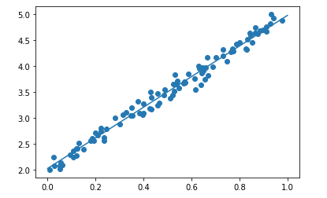

- データ個数　100個
  - d＝３x＋２
  - ノイズ：5
  - 誤差関数：平均2乗誤差
  - Optimizer：勾配降下法
  - 学習率：0.1

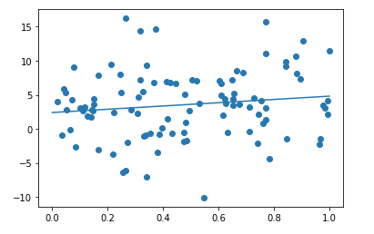

データの散らばりが大きくなるので正しく予測できない

##### 非線形回帰

- データ個数　100個
  - d=30x2+0.5x+0.2d=30x2+0.5x+0.2
  - ノイズ：0.05
  - Optimizer：Adam
  - イテレーション数：10000
  - 学習率：0.001

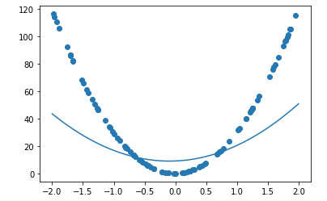

- イテレーション数：50000

に変更

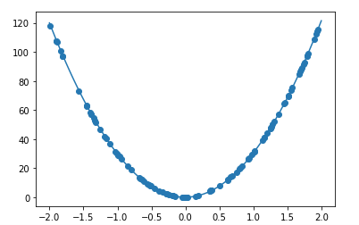

##### Mnist

１層のNNでMNIST

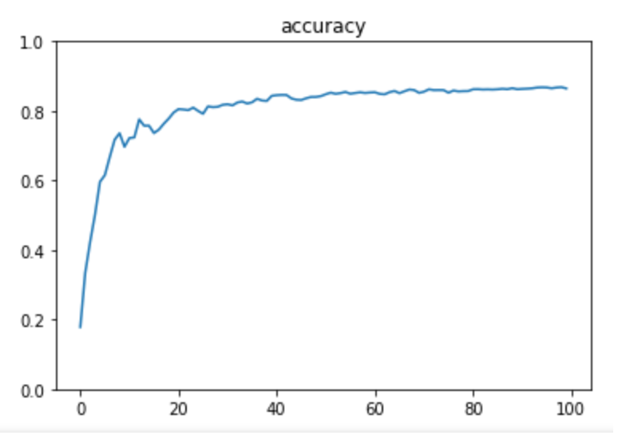

- 正答率が0.87

3層のNNでMNIST

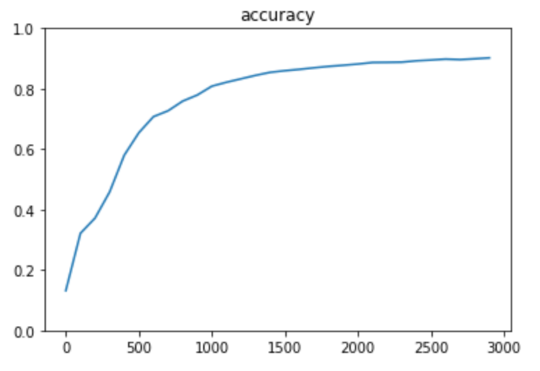

- 層を増やす事で精度の向上が見られる
- 正答率が0.9まで上昇

##### keras

- tensorflowのラッパー
  - tensorflowを使った実装をより簡単に行えるようにしてくれるもの
  - 複雑な構造を書く場合にはtensorflowを使わないといけない場合もある
- 特徴
  - variables, placeholderが不要
  - シンプルに書ける

#### 強化学習

##### 強化学習とは

長期的に報酬を最大化できるように環境のなかで行動を選択できるエージェントを作ることを目標とする機械学習の一分野  
行動の結果として与えられる利益(報酬)をもとに、行動を決定する原理を改善していく仕組み

応用例
  - キャンペーンメールの作成
    - キャンペーンの作成にかかるコスト（負の報酬）と売り上げによる報酬（正の報酬）のバランスをみながら、メールの送信するか否かを決定する

##### 探索と利用のトレードオフ

環境について事前に完璧な知識があれば、最適な行動を予測し決定することは可能。

⇒どのような顧客にキャンペーンメールを送信すると、どのような行動を行うのかが既知である状況

⇒強化学習の場合、上記仮定は成り立たないとする。不完全な知識を元に行動しながら、データを収集。最適な行動を見つけていく

過去のデータで、ベストとされる行動のみを常に取り続ければ他にもっとベストな行動を見つけることはできない

探索と利用の調節が重要

##### 強化学習の差分

目的が大きく異なる

- 教師あり・なし学習
  - データに含まれるパターンを見つけ出す
  - データからの推測
- 強化学習
  - 優れた方策を探索を行いながら見つけ出す

##### 強化学習の歴史

- 歴史
  - 冬の時代があったが、計算速度の進展により大規模な状態をもつ場合の、強化学習を可能としつつある。
  - 関数近似法と、Q学習を組み合わせる手法の登場
- Q学習
  - 行動価値関数を、行動する毎に更新することにより学習を進める方法

- 関数近似法
  - 価値関数や方策関数を関数近似する手法のこと

まとめると、強化学習はマシンの進化や新たな手法、組み合わせの登場により精度が格段に高まり再び注目されるようになっている

##### 行動価値関数
- 種類
  - 状態価値関数
    - ある状態の価値に注目
  - 行動価値関数
    - 状態と価値を組み合わせた価値に注目
    - Q学習は行動のたびに更新する

- 方策関数
  - 方策ベースの強化学習手法において、ある状態でどのような行動を採るのかの確率を与える関数のこと

##### 方策勾配法

方策をモデル化して最適化する手法
⇒方策勾配法

θt+1=θ(t)+ϵ∇j(θ)

J：方策の良さ→予め定義しておく必要がある

- Jの定義方法
  - 平均報酬
  - 割引報酬和

上記の定義に対応して、行動価値関数:Q(s,a)の定義を行うと方策勾配定理が成り立つ

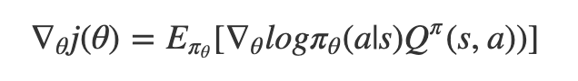